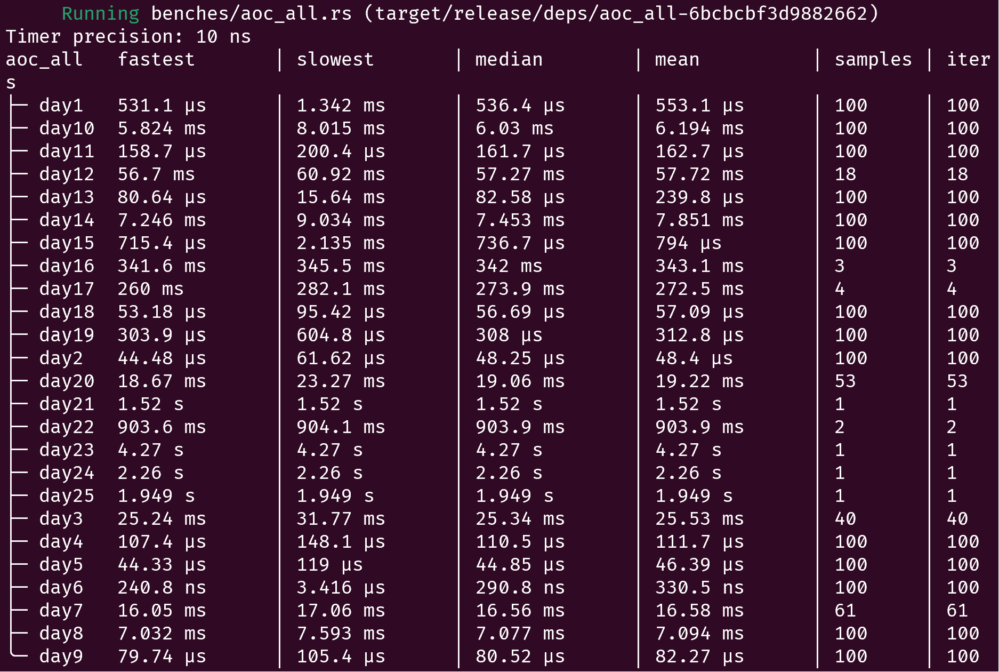

# Advent of Code 2023



Run the current day:
```bash
cargo watch -x "run --release"
```

Run tests:
```bash
cargo watch -x "test --release -- --nocapture"
```

## To Do
1. Day 7: Refactor Hand Detection using `itertools::counts()`
1. Day 10: Account for different shapes of `Start` to make tests pass
